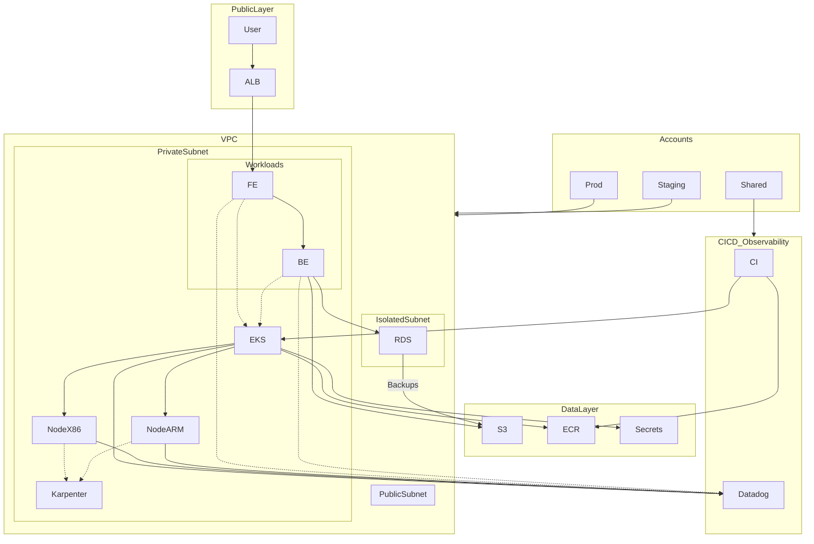

# Innovate Inc. Cloud Architecture Design

## Overview
This document proposes a robust, scalable, secure, and cost-effective AWS-based architecture for Innovate Inc.'s web application, leveraging managed Kubernetes (EKS), PostgreSQL, and best practices for cloud-native deployments.

---

## 1. Cloud Environment Structure
- **Accounts:**
  - **3 AWS Accounts:**
    - `prod`: Production workloads
    - `staging`: Pre-production/testing
    - `shared-services`: CI/CD, monitoring, IAM, networking
  - **Justification:**
    - Security isolation, cost tracking, and least-privilege access.
    - Follows AWS best practices (multi-account strategy).

---

## 2. Network Design
- **VPC per environment** (prod, staging)
- **Subnets:**
  - Public (load balancers, NAT)
  - Private (EKS nodes, app pods)
  - Isolated (databases)
- **Security:**
  - Security groups, NACLs, no direct public DB access
  - Private endpoints for S3, RDS, ECR
  - VPC Flow Logs enabled

---

## 3. Compute Platform (EKS)
- **EKS for Kubernetes:**
  - Managed node groups (x86, arm64)
  - Karpenter for autoscaling
  - Spot and On-Demand mix
- **Scaling:**
  - HPA for pods, Karpenter for nodes
- **Resource Allocation:**
  - Resource requests/limits, taints/labels for workloads
- **Containerization:**
  - Images built via CI/CD (GitHub Actions, CodeBuild)
  - Images stored in ECR
  - Automated deployments via ArgoCD (personal preference), but Flux is also a viable alternative

---

## 4. Database
- **Service:** Amazon RDS for PostgreSQL (Multi-AZ)
- **Backups:** Automated daily snapshots, PITR enabled
- **High Availability:** Multi-AZ, automatic failover
- **Disaster Recovery:** Cross-region snapshots, regular DR drills

---

---

## 5. Observability
- Datadog is recommended for monitoring, metrics, and logs (alternatives: AWS CloudWatch, Prometheus/Grafana)

---

## 6. High-Level Architecture Diagram

---

## 7. Security Best Practices
- IAM least privilege
- Secrets in AWS Secrets Manager
- Encryption in transit and at rest
- Audit logging (CloudTrail, GuardDuty)

---

## 8. Cost Optimization
- Use of Spot instances
- Rightsizing, auto-scaling
- Scheduled scaling for off-hours
- Monitor with AWS Cost Explorer

---

## 9. CI/CD
- GitHub Actions triggers build/test/deploy
- ArgoCD/Flux for GitOps deployment
- Automated rollbacks and notifications
